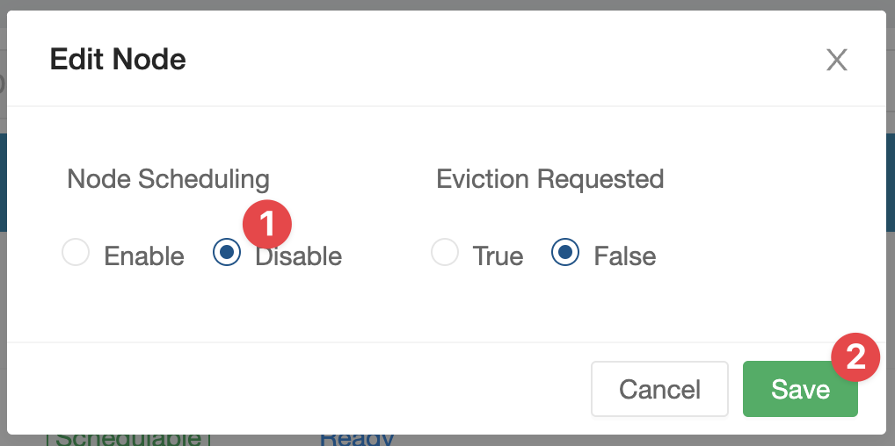

# Setup Longhorn on K3s

First you must install open-iscsi on the nodes:

```bash
sudo apt update && sudo apt upgrade --yes && sudo apt install open-iscsi --yes
```

Then install longhorn:

```bash
cd longhorn/
./setup.sh
```

Once everything is set up and running Longhorn UI can be accessed from:

https://longhorn.k3s.pro

At that point you may want to disable the control-plane storage from being used, this can be done from the UI (although there is probably a way to do it in a more declarative way as well):




## Making Longhorn The Default StorageClass

To avoid having to specify we want longhorn as the StorageClass whenever provisioning, we should make it the default storage class.

First let's look at all the storage classes in our cluster:

```bash
kubectl get storageclasses.storage.k8s.io
```

```
NAME                   PROVISIONER             RECLAIMPOLICY   VOLUMEBINDINGMODE      ALLOWVOLUMEEXPANSION   AGE
local-path (default)   rancher.io/local-path   Delete          WaitForFirstConsumer   false                  206d
longhorn (default)     driver.longhorn.io      Delete          Immediate              true                   16h
```

After installing Longhorn, it appears to set itself as the default, but the k3s pre-existing storage class (`local-path`) is also set as default. Let's toggle `local-path` default annotation off:

```bash
kubectl patch storageclass local-path -p '{"metadata": {"annotations":{"storageclass.kubernetes.io/is-default-class":"false"}}}'
```

Now when we get all the storage classes, it will look like this:

```bash
kubectl get storageclasses.storage.k8s.io
```

```
NAME                 PROVISIONER             RECLAIMPOLICY   VOLUMEBINDINGMODE      ALLOWVOLUMEEXPANSION   AGE
longhorn (default)   driver.longhorn.io      Delete          Immediate              true                   16h
local-path           rancher.io/local-path   Delete          WaitForFirstConsumer   false                  206d
```
